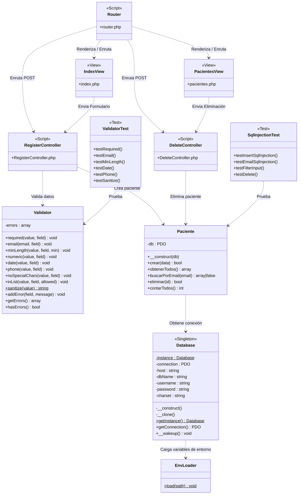

# Diagrama de Arquitectura y Clases — ClinicaApp

El siguiente diagrama representa la arquitectura Modelo-Vista-Controlador (MVC), componentes de infraestructura y el conjunto de pruebas del proyecto:

