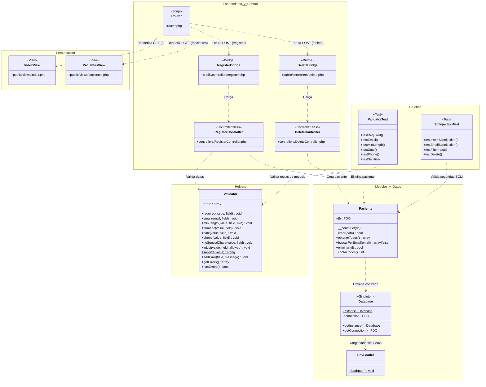

# Diagrama de Arquitectura y Clases — ClinicaApp

El siguiente diagrama representa la arquitectura del proyecto basada en el patrón Modelo-Vista-Controlador (MVC), junto con sus componentes de infraestructura, utilidades y la suite de pruebas unitarias y de seguridad.

